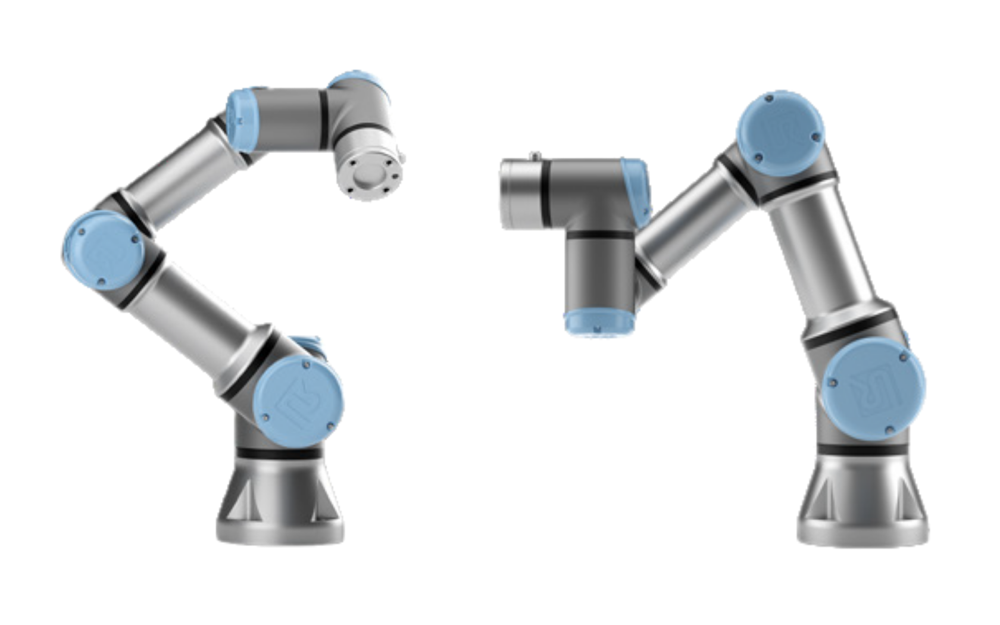
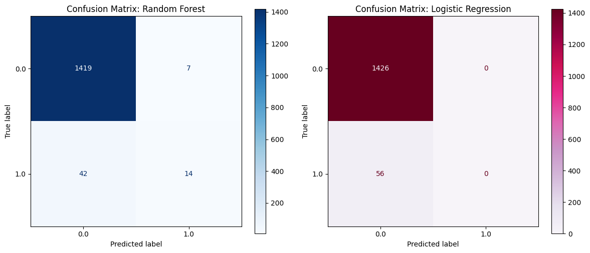
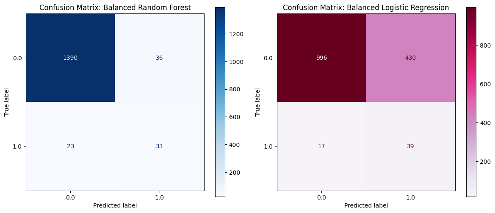
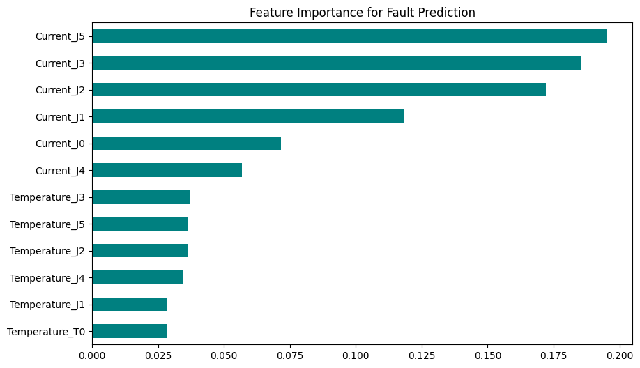

# Predictive Fault Classification for UR3 Collaborative Robots

[Explore the UR3 Fault Diagnostic App 🤖](https://www.google.com/search?q=https://ur3-predictive-maintenance.streamlit.app/)

<p>

</p>

This project compares **Random Forest** and **Logistic Regression** classifiers and selects the best-performing model to predict and differentiate between healthy operation and faults (Robot Protective Stop) for a UR3 Cobot. The selected model achieves an **F1-Score** of 0.53 and a **real-time inference latency** of 6.47 ms, effectively distinguishing between normal operation and "Protective Stop" faults in Universal Robots (UR3) Cobot.


## 📌 Project Overview

In industrial environments, fault prediction is challenging because failures are rare events compared to normal operations. This project addresses the issue of fault prediction by comparing a Logistic Regression model against a Random Forest model. The final solution utilizes **Synthetic Minority Over-sampling Technique (SMOTE)** to resolve class imbalance, ensuring the model identifies the fault-state boundary for the UR3 Cobot rather than ignoring it to maximize accuracy.


## 🛠️ Tech Stack

* **Machine Learning:** Scikit-Learn, Imbalanced-Learn
* **Language:** Python
* **Data Processing:** Pandas, NumPy
* **Visualization:** Matplotlib, Seaborn
* **Web Framework:** Streamlit
* **Development Environment:** VS Code, Jupyter Notebook

## 🔳 Key Features

* **SMOTE Balancing:** Utilizes Synthetic Minority Over-sampling to raise Fault Recall from 0% to 59%, preventing the model from being "blind" to critical failures.
* **Feature Importance Analysis:** Identifies critical mechanical stressors, specifically highlighting the **Elbow Joint (J2)** and **Wrist Joints** as primary precursors to protective stops.
* **Web Interface:** A real-time Streamlit dashboard with an adjustable Sensitivity Slider to adjust detection thresholds dynamically for fault detection accuracy.
* **Performance Visualization:** Includes Confusion Matrices (Imbalanced vs Balanced) and Classification Reports.

## 📂 Dataset

The model is trained on the **[UR3 CobotOps Dataset](https://archive.ics.uci.edu/dataset/963/ur3+cobotops)**.

* **Target Variable:** Binary (0: Healthy, 1: Protective Stop)
* **Features:** 12 sensor inputs (6 Joint Currents, 6 Joint Temperatures).
* **Total Instances:** 7,409 operational cycles.
* **Fault Cases:** < 4% (Highly Imbalanced).

## 📁 Repository Structure

<pre>
├── app
│   ├── ur3cobot_streamlit.py
├── app_assets
│   ├── ur3cobotop.png  
├── data
│   ├── dataset_02052023.xlsx    
├── model_and_scaler
│   ├── scaler.pkl       
│   ├── ur3_balanced_model.pkl
├── model_train
│   ├── ur3_cobots_fault_classification.ipynb       
├── results
│   ├── confusion_matrix_balanced_model.png    
│   ├── confusion_matrix_imbalanced.png
│   ├── feature_importance.png                 
├── LICENSE
├── README.md
└── requirements.txt                    
</pre>

## 🚀 Getting Started

Follow these steps to set up the project locally.

### Prerequisites

**Python 3.8+**

### 1. Clone the Repository

```bash
git clone https://github.com/Oluwatobi-coder/Predictive-Fault-Classification-UR3-Cobots.git
cd Predictive-Fault-Classification-UR3-Cobots

```

### 2. Install Dependencies

```bash
pip install -r requirements.txt

```

## 🧠 Data Balancing, Model Training and Evaluation

If you want to execute the training phase and regenerate the balanced model assets:

1. Open `ur3_cobots_fault_classification.ipynb` notebook in the `model_train` directory.
2. Run the each cell. The fitted model is saved as `ur3_balanced_model.pkl` and the scaler as `scaler.pkl`.

**Note:** The system benchmarks two models. While **Logistic Regression** is faster (0.41 ms), it fails to detect faults accurately (8% Precision). The **Random Forest** is selected for deployment as it achieves the best balance between Safety (Recall) and Efficiency (Precision), with an inference speed of **6.47 ms**—well within the 10ms limit for industrial control loops.

## 🌐 Running the Streamlit App

To interact with the fault predictor tool locally:


1. Run the Streamlit command:
```bash
streamlit run ./app/ur3cobot_streamlit.py

```

2. Use the sliders to simulate real-time joint currents and temperatures to see the fault probability.

## 📊 Results

* **Confusion Matrices:** Visualized to show the impact of balancing the dataset (SMOTE).
<p align="center">


</p>

* **Feature Importance:** Ranking which robot joints contribute most to failures.
<p align="center">


</p>


## 🤝 Contributing

Contributions are welcome to help improve the inference latency or explore Deep Learning approaches (LSTM/RNN) for this dataset:

* Fork the repository.
* Create a new branch (`git checkout -b feature-branch`).
* Commit your changes.
* Push to the branch and open a Pull Request.

## 📚 References

**Breiman, L.** (2001). Random forests. Machine Learning, 45(1), 5–32. https://doi.org/10.1023/A:1010933404324

**Chawla, N. V., Bowyer, K. W., Hall, L. O., & Kegelmeyer, W. P.** (2002). SMOTE: Synthetic minority over-sampling technique. Journal of Artificial Intelligence Research, 16, 321–357. https://doi.org/10.1613/jair.953

**Tyrovolas, M., Aliev, K., Antonelli, D., & Stylios, C.** (2024). UR3 CobotOps [Dataset]. UCI Machine Learning Repository. https://doi.org/10.24432/C5J891


**Universal Robots.** (2025). UR3e technical specifications. Retrieved December 7, 2025, from https://www.universal-robots.com/products/ur3-robot/


## 📜 License

This project is licensed under the MIT License - see the `LICENSE` file for details.

If you find this implementation helpful, please ⭐ the repository!
